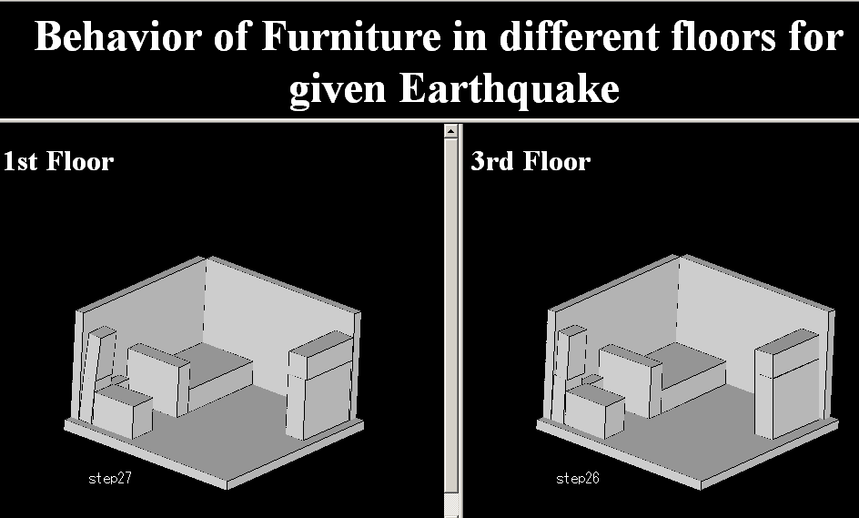
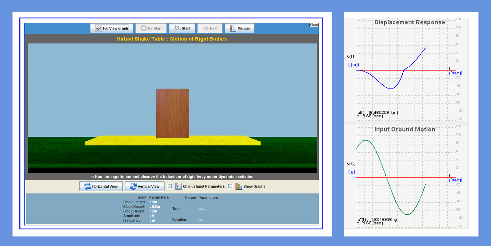

Shake table is an experimental set-up where buildings can be vibrated using real ground motion to test the resistance of structures and to demonstrate the sensitivity of structures of different heights to the frequency of the ground motion.

To understand the behavior of rigid blocks (or furniture) to given amplitude and frequency of ground motion. Shake table is an experimental set-up where buildings can be vibrated using real ground motion to test the resistance of structures and to demonstrate the sensitivity of structures of different heights to the frequency of the ground motion.

 
 
    
To understand the behavior of rigid blocks(or furniture) to given amplitude and frequency of ground motion.
    
 

