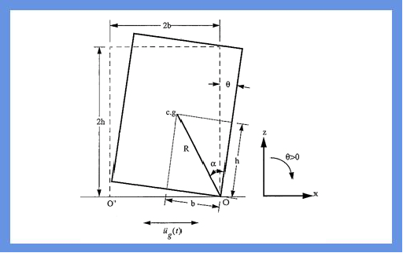

 

The equations that govern the rocking motion under the simultaneous presence of,

-- horizontal ground accelaration and,

ug(t)-- vertical ground acceleration are ..

[Read More](doc/7.Theory.pdf)
